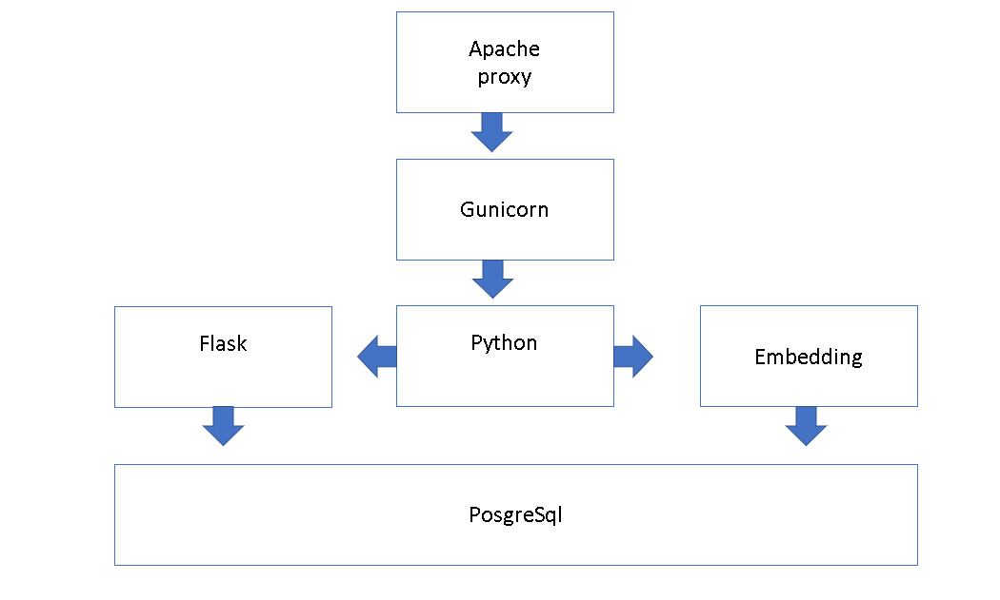
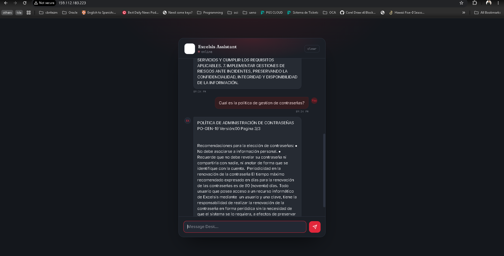

# Chatbot Interno Excelsis SA

## IntroduccióExcelsis SA es una empresa tecnolóa lír en el mercado. Actualmente tienen un requerimiento de implementar un chatbot interno de manera de ayudar a los funcionarios a obtener informacióe los procedimientos y polícas internas de la empresa, asíomo tambiélos procedimientos definidos por las normas ISO.

## Alcance

El chatbot se encargaráe ayudar a los funcionarios de la empresa a conocer las polícas y definiciones de la empresa. Estos documentos PDF aprobados se cargaráa una base de datos y posteriormente se realizarál embedding utilizando el modelo `all-MiniLM-L6-v2`.

## Requisitos

Para implementar esta solucióe requiere:

- Un servidor hosteado en la nube de OCI.
- Un motor de base de datos (inicialmente se utilizaráostgreSQL).
- Python y las siguientes librerí:
  - `psycopg2-binary`
  - `pypdf`
  - `sentence-transformers`
  - `flask`
  - `gunicorn`
- El frontend se lanzaráediante una aplicaciólask y se utilizarápache en modo proxy para servir la interfaz.

## Arquitectura

## Operaciones

Para que todo el circuito de este chatbot funcione se deberádefinir las siguientes operaciones:

- **Carga de documentos:** inicialmente la carga de documentos se realizaráe forma manual, pero posteriormente se implementarán file watcher que procesaráos nuevos archivos que se vayan cargando, ya sea en un repositorio Git o en un object storage de OCI.
- **Interaccióon el usuario:** las respuestas del chatbot se realizaráejecutando una consulta de vector en la base de datos.

## Prueba de Funcionalidad

La siguiente imagen es una muestra de la funcionalidad del chatbot.

## URL

Puede acceder al chatbot haciendo click en la URL: [http://chatbot.cbritezm.com](http://chatbot.cbritezm.com) o [http://159.112.183.223](http://159.112.183.223)
